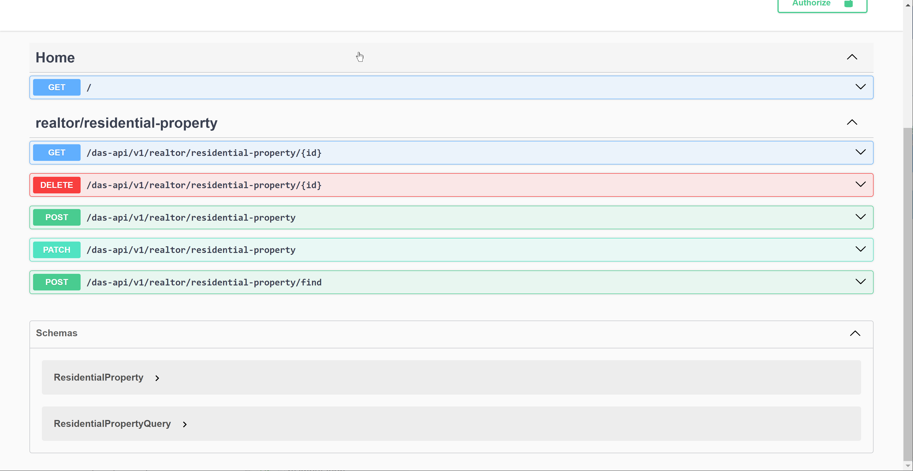

# React Dashboard Starter
**React dashboard boilerplate project.**\
[](https://sonarcloud.io/summary/new_code?id=j1032w_das-mono-nestjs-reactjs)
[](https://gitlab.com/j1032w/das-mono-nestjs-reactjs/-/pipelines)
[](https://opensource.org/licenses/MIT)
<a href="https://github.com/j1032w/das-mono-nestjs-reactjs" target="_blank"></a>
[](https://www.paypal.com/donate/?hosted_button_id=29ZE3URD5V9Q8)

#### The Angular edition of Dashboard Starter can be found at https://github.com/j1032w/dashboard-starter





# Features

- Built with  [ReactJS 16](https://react.dev/), [NestJS 10](https://nestjs.com/), [MongoDB 6](https://www.mongodb.com/), [Typescript 5](https://www.typescriptlang.org/), [react-redux 7](https://react-redux.js.org/), and [Material UI 5](https://mui.com/)
- [Nx](https://nx.dev/) monorepo structure with [vite](https://vitejs.dev/) builder  
- Integrate with [GraphQL](https://graphql.org/), REST API and [Swagger](https://swagger.io/)
- Follows [clean architecture](https://blog.cleancoder.com/uncle-bob/2012/08/13/the-clean-architecture.html)
- Integrated [CSS Module](https://github.com/css-modules/css-modules) with [SCSS](https://sass-lang.com/documentation/syntax) 
- Unit testing with [Jest](https://jestjs.io/) and [React Testing Library ](https://testing-library.com/docs/react-testing-library/intro/) 
- E2E automation testing with [Cypress](https://www.cypress.io/)
- [ESlint](https://eslint.org/) and [Prettier](https://prettier.io/)
- [Gitlab](https://gitlab.com/j1032w/react-dashboard-starter/-/pipelines) CI/CD pipeline


# Quick start with docker
1. Clone repository
```
git clone https://github.com/j1032w/das-mono-nestjs-reactjs.git
```
2. Running docker compose
```
docker compose build
docker compose up -d
```
3. Navigate to \
   UI: http://localhost:8080/ \
   API: http://localhost:3000/ \
   GraphQL: http://localhost:3000/graphql


# Development

#### Start RactJS UI development server, port: 4200
```
yarn start-ui
``` 
#### Start NestJS webapi server, port: 3000
```
yarn start-api
``` 

#### Running unit tests
```
yarn test
```

#### Running eslint
```
yarn lint
```

#### Running build
``` 
yarn build
``` 

# Design


# GitLab CI/CD Pipeline
https://gitlab.com/j1032w/das-mono-nestjs-reactjs/-/pipelines

[](https://gitlab.com/j1032w/react-dashboard-starter/-/pipelines)


# SonarQube static code analysis
https://sonarcloud.io/summary/overall?id=j1032w_das-mono-nestjs-reactjs

[](https://sonarcloud.io/summary/overall?id=j1032w_das-mono-nestjs-reactjs)
